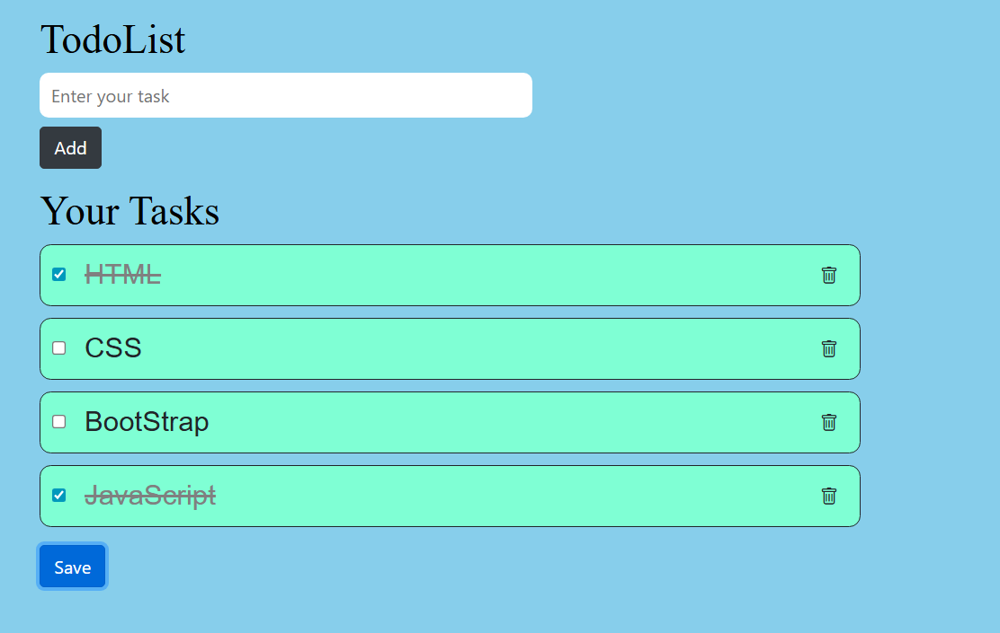

# 📝 Todo List

A simple and responsive **To-Do List Web Application** built using **HTML, CSS, Bootstrap, and JavaScript**.  
This app allows users to add, mark as complete, and delete tasks — helping manage daily activities efficiently.

---

## Features
- ➕ Add new tasks easily  
- ✅ Mark tasks as completed  
- ❌ Delete unwanted tasks  
- 💾 Tasks persist in local storage (if implemented)  
- 🖥️ Fully responsive using Bootstrap  

---

## 📸 Screenshot


---

## 🌐 Live Demo
👉 [View the live demo here](https://srikarnulu.github.io/todo-list/)

---

## ⚙️ How to Use
1. Clone the repository:  
   ```bash
   git clone https://github.com/srikarnulu/todo-list.git
2. Open index.html in your browser.
3. Start adding tasks and enjoy managing your to-dos!

🧠 Technologies Used

    HTML5 – Structure of the web app 
    CSS3 – Styling and layout 
    Bootstrap – Responsive design 
    JavaScript – Functionality and interactivity

🧑‍💻 Author

    Name: Srikar Nulu
    Email: srikar3908@gmail.com
    LinkedIn: https://www.linkedin.com/in/srikar1/
    ⭐ If you find this project useful, consider giving it a star!

🕒 Last Updated
    October 6, 2025
